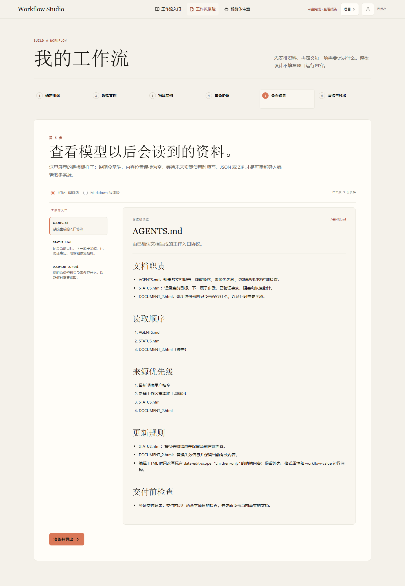

# Workflow Studio

Workflow Studio 是一个本地优先的工作流设计网页，用来帮助用户为 AI 或模型协作设计可持续维护的工作流文档。

它引导用户先确定需要哪些文档及其职责，再通过章节、信息项、常驻填写说明和展示方式搭建内容；系统随后生成 `AGENTS.md` 入口协议，并提供结果预览、恢复演练和完整导出。



## 核心能力

- 面向新手的工作流入门与六步搭建路径。
- 从标准文档组合或空白项目开始设计。
- 使用段落、项目列表和步骤三种直观排版组织信息项。
- 自动生成精简的 `AGENTS.md`，并允许调整读取顺序、必读/按需和来源优先级。
- HTML 阅读文件按段落、清单或步骤保留格式锁和值槽边界，便于模型安全填入内容。
- 预览 HTML 与 Markdown 阅读文件，并演练模型恢复路径。
- 通过独立的“智能体审查”入口连接任意 OpenAI 兼容 Chat Completions 地址，获取固定结构的长期稳定与维护效率审查意见。
- 审查报告可定位回真实的资料、章节、信息项或协议排序；建议始终由用户手动修改和重新审查。
- 导入、导出 `workflow.json` 或完整 ZIP；兼容旧版项目内容与只读高版本包。
- 数据保存在本地浏览器，不依赖后端、账号或云服务。

## 本地运行

需要 Node.js 20 或更高版本。

```bash
npm ci
npm run dev
```

Vite 会输出本地访问地址，默认通常为 `http://127.0.0.1:5173/`。

## 质量检查

```bash
npm run typecheck
npm run lint
npm run test -- --run
npm run build
npm run test:e2e
npm run screenshots:handoff
```

端到端测试覆盖桌面与移动端的创建、编辑、协议生成、结果预览、导入兼容、键盘操作和导出流程。截图门禁覆盖 1440、1024、393、360 与 320px 视口。

## 技术栈

- React、Vite、TypeScript
- Zustand、Immer、IndexedDB
- Vitest、Playwright、Axe
- JSZip、Lucide React

## 数据说明

- `workflow.json` 是可重新导入编辑的结构化事实源。
- HTML 与 Markdown 是便于人类和模型阅读的生成文件。
- 新建模板不会预填项目运行事实；信息项内容在实际使用工作流时填写。
- 独立导入 HTML 或 Markdown 不会覆盖当前项目，应导入 `workflow.json` 或完整 ZIP。
- 审查连接名称和模型名仅保存在当前浏览器；完整请求地址与 API Key 只保留在当前会话，刷新或关闭标签页后会清除。
- 审查提示词和最近一份有效报告按工作流保存在本机，不会写入或导出到 `workflow.json`、ZIP、HTML 或 Markdown。
